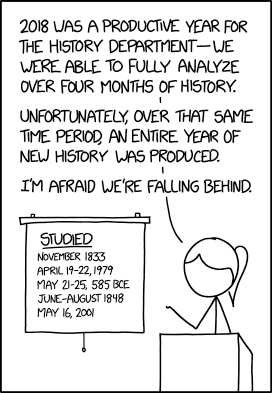

The way that, in all walks of life, things are becoming more and more digitised has a number of different consequences for historical studies, on many levels:
when it comes to research and the work with sources, using digital methods not only for analysis but also for communication, and finally for teaching in higher education.

{fig-align="left"}

## Digitised Sources, Digital Sources

As historians, sources are central to our analyses. 
That means that access and availability of documents has a great influence on what questions we are able to answer or which analyses we can undertake.
Restrictions as to access, which can influence the size and quality of our corpus, can be set by institutions such as museums, archives and libraries, for instance when contemporary documents are protected for a period of time, or an object is too fragile for use. 
It can also be difficult for financial or organisational reasons to access archives further away, in order to be able to include more documents in one's analysis. 
Large-scale digitisation project in libraries and archives thus offer the possibility of finding additional material not just as a catalogue entry but as actual digitised copies that one can download onto one's own computer.
Especially for valuable historical objects  -- such as antique papyri, early medieval manuscripts, early printed documents etc -- this offers a possibility of making the objects available to a far larger audience without the strain of continuous usage, and without the users having to take long journeys to see them. 
For medieval manuscripts and early modern manuscripts and prints for instance there are nowadays many (mostly national) portals that allow a central search of all collections; 
you will find a selection in @sec-projects-ma-fnz.

Next to the digitisation of existing sources (retro digitisation) we have the unstoppable production of new sources purely in digital form (born digital data). 
The relative scarcity of sources often bemoaned by scholars of premodern history is in opposition to the surfeit of contemporary material. 
Both situations -- too little, too incomplete and too much, too confusing -- come with methodological difficulties: 
How does one put together a corpus (a collection) of sources that contains sufficient documents to allow one to answer questions, underline theses and gain new insights, but still remains manageable? 
Historians need to acquire new competencies in order to deal with such questions: 
in addition to the classic souce critical analysis we now need digital source criticism, in addition to the ability to read and understand analogue sources, the ability to do the same for the digital realm. 
More about digital literacy and digital criticism in [chapter 3](03_digital_literacy_criticism.en.qmd).

## Digital Tools for Analysis{#sec-digitaltools}

The definition already cited  [here](01_intro.en.qmd) that it is the active critical use of digital tools in teaching, research and study which makes up the Digital Huminities, begs the question of what exactly we mean by digital tools and to what ends we use them. 
Even reading this guide without digital methods is not possible -- it does not exist in printed form. 
Reading at the screen does not make you a *digital humanist*, but one does not need to learn programming to be able to use the computer for one's own work and to achieve results that would not have been possible in the same measure with classical methods -- in history mainly paper-based *close reading* of sources and scholarly texts.

Research that uses digital methods is usually scaleable -- if one is using software that counts the frequency of terms in one document, it should not make a difference to the software whether it does this with one or with one hundred documents. 
If you do this by hand however, the amount of analysis grows in proportion to the amount of documents. 
So digital tools allow us, amongst other things, to ask the same question of a far larger corpus of sources. 
It also allows us to ask different questions of this large corpus than would be possible with a small one. 
In the main, historical sources are text-based. 
Written by hand, carved, or printed -- and with the possibility of changing this text via text recognition software into data that is readable to a computer, sources can be turned into data that is able to be examined and analysed with the help of quantitative methods.^[This is easier to do for contemporary history, as many texts are already extant in digital form, for those periods or fields that are generally less rich in sources, generating data from text can nevertheless be even more interesting.]

For Literary studies, for instance, one important field of use is to check for authorship. 
Whether an anonymous text can be attributed to a known author can either be judged by a literary scholar through *close reasding* of the text, or through the search for patterns, for quantifiable attributes of a text, such as the frequency of function words, particles, punctuation etc. 
The detective novel *The Cuckoo's Calling*, published under the pseudonym of Robert Galbraith, could be attributed to Joanne K. Rowling by the relevant software -- and this in thirty minutes, about as much time as it takes to read twenty pages of the novel.  [Here](https://www.smithsonianmag.com/science-nature/how-did-computers-uncover-jk-rowlings-pseudonym-180949824/) you can read an article that deals with this case and situates it within the field of linguistic forensics, which investigates offenders with the help of quantitative text analysis.  
A video about the development and use of software for authorship attribution can be found [here](https://cmu-lib.github.io/dhlg/project-videos/juola/).
The software used, JGGAP,^[Java Graphical Authorship Attribution Program, [http://evllabs.github.io/JGAAP/](http://evllabs.github.io/JGAAP/).] can obviously also be used for historical analysis -- think of regimes with strict censure and numerous authors not publishing under their real names. 
By identifying anonymous writers different themes connected with censure can be studied: 
which authors were publicly recognised, who at the same time published anonymously and under their real names, which authors wrote in exile, what networks can be reconstructed, etc. 
Having a programme that *can* do the quantitative analysis and thus the main job of identification (on how to think carefully about data and algorithms, see [chapter 3](03_digital_literacy_criticism.en.qmd) --, means that there is more time remaining for the qualitative analysis. 
At the same time the analysis is based on a significant amount of data instead of looking just at individual cases.

The idea is not to play off qualitative and quantitative methods against each other, rather show that both methods have positive and negative aspects and that in the best case they can be used to good advantage in combination.
Quantitative analysis just for the sake of it and without specific historical question is hardly ever of added value.

Depending on the data base, analytical purpose and research question, there are different tools you can use. 
For most of the research you will be doing during your studies, existing software should be sufficient, be it for statistical analysis, network analysis, geomapping or visualisation. 
You can find a selection of tools (all free of charge / open source) under the heading [Literature, Tools, Tutorials](further_resources.en.qmd##Tools for digital history). 
For certain analyses it can be helpful to learn some basic programming skills -- being able to write your own scripts (smaller programmes) means having full control over the way in which data is read, prepared, enriched, analysed and visualised; 
with repeated processes that take a lot of time when doing them by hand, a lot of time can be saved.

For projects in the humanities there are at the moment two programming languages mainly being used, [R](https://cran.r-project.org/index.html) and [Python](https://www.python.org/). 
Since both are popular in the humanities you can nowadays find numerous packages that make data and text mining (large-scale data and text analyses) very easy. 
Such packages for programming languages are like plug-ins for programmes, for instance like an ad blocker for the browser. 
These were not originally intended by the developers, but someone wanted to block advertisements and wrote a programme to do so, making it free for the general public to use. 
The difference in a package is that a package offers numerous different functions that the users can then choose and implement. 
Who has not had any contact with programming in school and university may possibly have some trepidation at first, but once again: 
you do not need to be able to programme in order to do quantitative work. 
There is a project called  ["The Programming Historian"](https://programminghistorian.org/), which has offered numerous tutorials since 2008 for historians without previous programming experience, introducing different tools, techniques and workflows for historical research and teaching.

## Digital Tools for Communication

Even without quantitative/computer based analyses there are various options in historical research to use digital methods to assist in communicating results.
These are on the one hand different types of digital publishing and on the other the use of digital tools to visualise results. 
Printed academic journals and publishers have certain criteria for accepting texts for publication -- content quality is important for any academic work, but formal criteria such as length/imaging etc. are less central for online formats. 
In this way first results from a new research project or even a seminar paper can be offered up to an interested audience in the form of a blog article without much organisational preparation or regard for a publisher's workload.\
The number of academic blogs has been rising continuously in recent years, so that there are a number of suitable publication options available for every possible subject. 
These are edited, meaning that they are in the hands of academics who see themselves as responsible for the quality of the contributions. 
PhD projects are also often accompanied by blogs -- giving visibility to the research and offering a space for themes that have no room in the actual dissertation, but are still noteworthy.\
[Hypothèses](https://hypotheses.org/about-hypotheses) has established itself as an important platform that hosts a number of academic blogs. 
You can find a catalogue of all the blogs  [here](https://www.openedition.org/catalogue-notebooks?page=catalogue&pubtype=carnet&lang=en), and you can filter according to subject and period.\ 
The following blogs are the result of research and teaching at the History Department of the University of Basel:

  - [Exilland Schweiz](https://exilschweiz.hypotheses.org/). Kulturschaffende und Intellektuelle im Schweizer Exil, 2021--\
  - [Global Health Africa](https://www.globalhealthafrica.ch/). Circulating Knowledge and Innovations, 2019--\
  - [Materialized Histories](https://mhistories.hypotheses.org/). Materielle Kultur und digitale Forschung, 2021--\
  - [Materialized Identities](https://www.materializedidentities.com/blog). Objects, Affects and Effects in Early Modern Culture (1450--1750), 2016--2021.\
  - [Stadt.Geschichte.Basel](https://www.stadtgeschichtebasel.ch/blog). Blog zum Forschungsprojekt, 2019--\
  - [The Color Line](https://colorline.hypotheses.org). Race Relations in Schlüsseltexten amerikanischer Autor:innen (1881--1953), 2022--

A relatively recent format are Data Stories -- narratives that describe a situation on the basis of (quantitative or qualitative) data and analyses. 
This type of (data) publication is used especially in journalism, and helps to ensure interactivity and actuality of data. 
There are various tools that can be used to create such data stories, some of them include publication possibilities; 
there is a selection under  [Literature, Tools, Tutorials](further_resources.en.qmd##Tools for digital history).\
One example that allows the users to add content themselves is [Darüber spricht der Bundestag](https://www.zeit.de/politik/deutschland/2019-09/bundestag-jubilaeum-70-jahre-parlament-reden-woerter-sprache-wandel#s=kohleausstieg%2Batomausstieg), a Data Story by the newspaper “DIE ZEIT”, which allows analysis of all the speeches given in the German Bundestag since 1949. 
An example for a map-centric depiction that embeds various different media is [Arya's Journey](https://storymap.knightlab.com/examples/aryas-journey/) from *Game of Thrones*.
An example for the use of public census data is by the Schweizer Bundesamt für Statistik,  [Die Schweiz (er)zählen](https://www.census1850.bfs.admin.ch/de/).

## Projects and Resources for Teaching and Research {#sec-projects}

### Ancient History

Projects:

- [D-Scribes](https://d-scribes.philhist.unibas.ch/en/): Project recognising ancient authors of Greek and Coptic papyri 

Resources/portals:

- [Papyprus Portal](https://www.papyrusportal.de/content/start.xml): digital collection of papyry

- [The Arabic Papyrology Database](https://www.apd.gwi.uni-muenchen.de/apd/project.jsp): Data base of premodern arabic texts written on papyri, parchment or paper from the 7th to the 16th century

### Middle Ages and Early Modern History {#sec-projects-ma-fnz}

Projects:

- [Burchards Dekret Digital](https://burchards-dekret-digital.de/): Digital edition analysing the manuscript transmission of the Decretum Burchardi

- [République des Lettres](https://republique-des-lettres.ch/): Edition and research platform with numerous collections of texts by scholars between 1700 and 1850, connected to structural data 

- [Printed Markets](https://avisblatt.philhist.unibas.ch/): Project digitising and commenting on the early modern "Avisblatt" from Basel (1729–1844)

- [Repertorium Academicum](https://repac.ch/): Project compiling data on european scholars between 1250 and 1550

Resources/portals:

- [dMGH](https://www.dmgh.de/index.htm): Monumenta Germaniae Historica online (Beta-Version)

-   [e-codices](https://www.e-codices.unifr.ch/de): Virtual Manuscript library of Switzerland 

-   [Fragmentarium](https://fragmentarium.ms/): Laboratory for Medieval Manuscript Fragments

-   [Handschriftenportal](https://handschriftenportal.de/): Central national register of book manuscripts in German libraries and in German language (in development)

- [Innovating Knowledge](https://innovatingknowledge.nl/): Data base and digital edition of Isidor of Sevilla’s "Etymologiae"

-   [e-manuscripta](https://www.e-manuscripta.ch/?lang=de): Digitised manuscripts from Swiss libraries and archives

-   [e-rara](https://www.e-rara.ch/?lang=de): Platform for digitised prints from Swiss Institutions

- [Gallica](https://gallica.bnf.fr/): Digitised sources from French libraries

- [Stapfer Enquête](https://www.stapferenquete.ch/): Edition of a Swiss school census from 1799

- [swisscollections](https://swisscollections.ch): search platform for historical Swiss collections

- [transcriptiones](https://transcriptiones.ch): platform for the creation, sharing and use of transcriptions of historical manuscripts

### Modern and Contemporary History

Projects:

- [impresso. Media Monitoring of the Past](https://impresso-project.ch/project/): project for the processing, semantic editing, representation, exploration and research of data in historical media (newspapers and radio), across time, languages and national borders

- [Living with Machines](https://livingwithmachines.ac.uk/about/): research project on the impact of the mechanisation of work during the industrialisation. 

- [Refugee History](http://refugeehistory.org/): academic blog and interactive network on the current debates around "refugees"

Resources/portals:

- [Datenbank Bild + Ton](https://www.bild-video-ton.ch/): on the history of Swiss social movements 

- [Dodis](https://www.dodis.ch/de): historical editions of documents on Swiss foreign affairs

- [Gallica](https://gallica.bnf.fr/): digitised sources from French libraries

- [e-newspaperarchives.ch](https://www.e-newspaperarchives.ch/): Schweizer Zeitungen online

- [e-periodica](https://www.e-periodica.ch/): Swiss newspapers online

- [Historische Statistik der Schweiz](https://hsso.ch/) (HSSO): historical statistic of Switzerland

- [histat](https://histat.safe-frankfurt.de/): historical statistics

### Jewish History

Projects:

-   [Digital Jewish Studies Online](https://jewishstudies.washington.edu/digital-jewish-studies/), Stroum Center for Jewish Studies, University of Washington

Resources/portals:

- [Blavatnik Archive](https://www.blavatnikarchive.org/): archive for the preservation of material on jewish history of the 20th century with a focus on the world wars and soviet Russia

-   Menny, Anna; Rürup, Miriam; Siegel, Björn: Jüdische Geschichte im deutschsprachigen Raum, in: Busse, Laura u. a. (Hg.): Clio-Guide. Ein Handbuch zu digitalen Ressourcen für die Geschichtswissenschaften, Berlin 2018, S. E.2-1--E.2-56. Online: <https://doi.org/10.18452/19244>.

### African History

Projects:

- [Emandulo](http://emandulo.apc.uct.ac.za/index.html): Digital archive that brings together and curates archival/museal collections and presentations on precolonial South African history

- [Legacies of British Slavery](https://www.ucl.ac.uk/lbs/): research project on the British slave trade and ownership

Resources/portals:

- [FHYA](https://fhya.org/): Experimental digital research platform on precolonial South African history

- [Legacies of British Slavery](https://www.ucl.ac.uk/lbs/): data base on British Slave trade and ownership 

- [Slave Voyages](https://www.slavevoyages.org/): data bases on the transatlantic and interamerican slave trade with a data base of individuals 

### Eastern European History

Projects:

- [Gulag: Many Days, Many Lives](https://gulaghistory.org/index.html): Archive and presentation on sovjet gulags

- [Gulag Online](https://gulag.online/): virtual museum with presentations and sources on life in the gulag

- [Seventeen Moments in Soviet History](https://soviethistory.msu.edu/): multimedia online archive with selected sources on events in soviet history based around 17 different years between 1917 and 1991

- [The Imperiia Project](https://scalar.fas.harvard.edu/imperiia/index): a spatial history of the Russian Empire

Resources/portals:

- [Blavatnik Archive](https://www.blavatnikarchive.org/): archive for the preservation of material on jewish history of the 20th century with a focus on the world wars and soviet Russia

- [The Other Side](http://tastorona.su/): Web archive with interviews of ex-Ostarbeiter, POWs and inmates of German camps. Publication platform

### Supra-national and Trans-epochal History

Projects:

- [Lord of the Rings Project](http://lotrproject.com/statistics/books/): interactive analysis of the work of JRR Tolkien

Resources/portals:

-   [Around DH in 80 days](https://arounddh.org/index.html): portal presenting 80 different Digital-Humanities-
Projects worldwide and from various disciplines  

- [Internet Archive](https://archive.org/): digital library archiving books, images, films, software, music and websites
