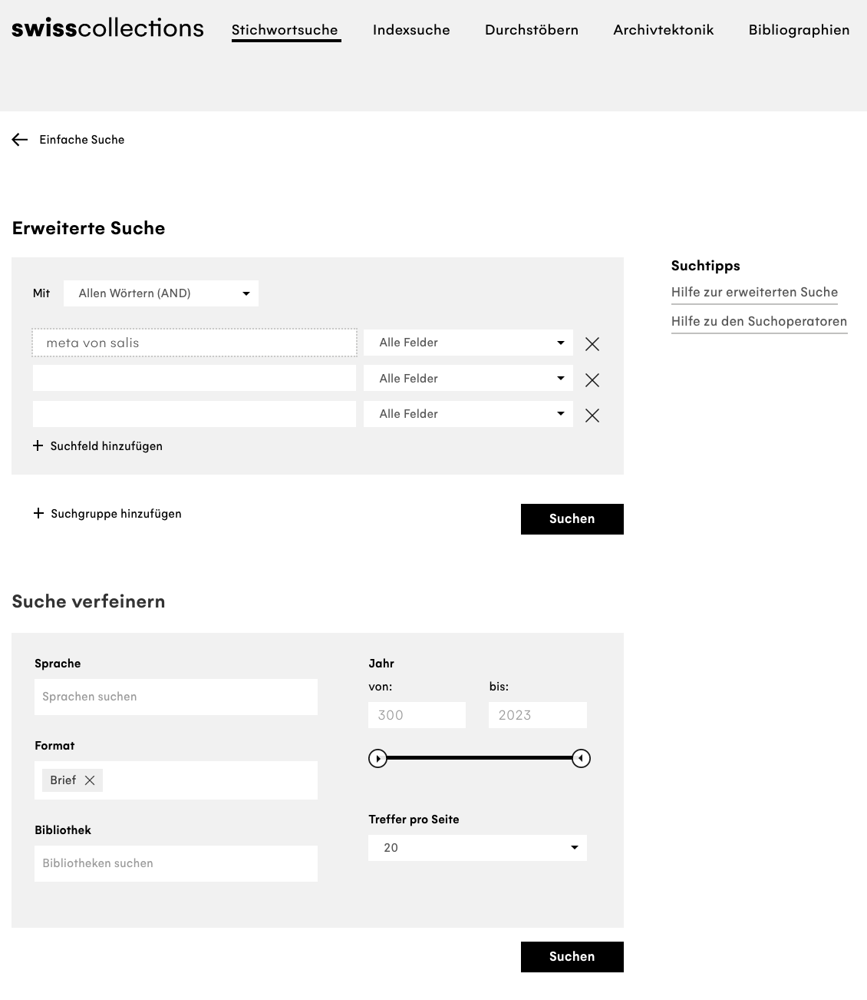
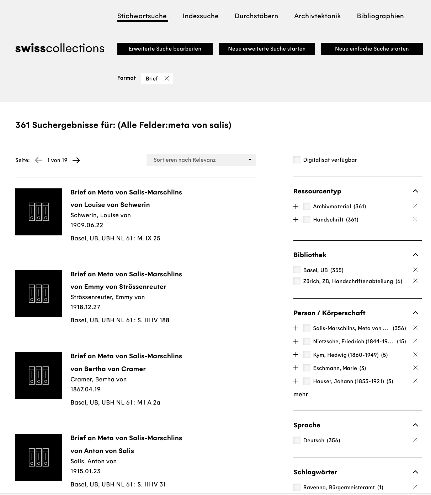
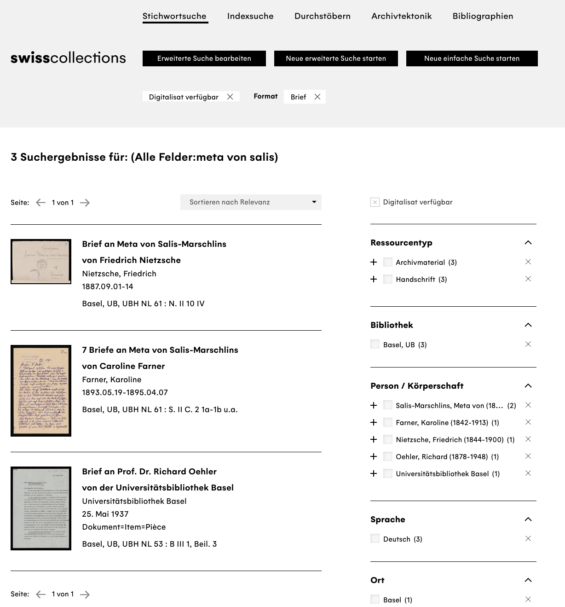

## Digital Literacy, Data Literacy

What we understand by Data Literacy is the competence to collect, manage, evaluate and use data,[@ridsdale_strategies_2015, p. 8] a competence everyone should develop for themselves in order to deal with all the various forms of data we encounter in everyday life nowadays. 
Depending on the discipline there are differences in the specific competencies necessary -- a humanities student may not think that algorithm criticism is the most important thing to learn when starting to study.^[Different organisations and interest groups have thought about this, and the German "Gesellschaft für Informatik" has published a white paper on Data Literacy and Data Science Education as a digital competence in higher education: <https://gi.de/fileadmin/GI/Hauptseite/Aktuelles/Aktionen/Data_Literacy/GI_DataScience_2018-04-20_FINAL.pdf>.]
But you do not need to understand every detail of machine learning software's source code in order to have a basic understanding of the way such applications function, and to be able to reflect on their usage. 
This kind of digital or data literacy is relevant especially when it comes to interpreting results that appear to be objective, or to have been produced without bias. 
A good example are the results of a query in a search engine. 
Depending on which engine you are using, different circumstances will play into generating your results list. 
For instance your own search history, meaning that [*search neutrality*](https://en.wikipedia.org/wiki/Search_neutrality) is no longer a given.^[There are alternative search engines, such as  [Startpage](https://www.startpage.com/) or [DuckDuckGo](https://duckduckgo.com/).]\
Go to [Google Image Search](https://images.google.com/) and search for "historian". What do you see?

If I did not know anything about historians, the results of my search would lead me to believe that a historian is an old, white man with glasses, a beard, and a large bookshelf. 
If you look around at the History Department in Basel, you might get a rather different impression. 
The results of search engines, that use algorithms in order to function, are biased: 
They are based on previous searches, preferences, geographical location -- and on metadata offered by humans, data with information about other data. 
It is part of working in a digitised world that we are aware of this, and know to question data.

## Digital Criticism, Data Criticism

Digitised Sources, just like purely digital ones, need advanced source criticism -- in the introductory course at the University of Basel you will learn the basics of classic source criticism:
Where does a source come from, who has created it under what circumstances? What objectives could have been behind the creation, what biases could be in the text due to the circumstances of its creation?
What can you read in a high-medieval king's chronicle, if the author was directly dependent on the person commissioning the work? 
How do we read the witness statements of an inquisition into witchcraft, if they were gathered under threat of torture? 
How carefully do we need to analyse the contents of a diary that was written with a view to later publication?

Apart from the internal criticism, working with sources always also concerns the question of the creation of corpora: 
what constitutes a significant corpus of sources that can be used for a specific historical question, but at the same time can be analysed in a manageable amount of time? 
Additionally, different types of sources bring different difficulties: 
With analogue sources that are also available in digitised form, there is the danger that a subject, area or aspect is neglected if only the immediately accessible, digitised collections are used. 
If for instance you are interested in the Swiss historian and women's rights advocate [Meta von Salis](https://de.wikipedia.org/wiki/Meta_von_Salis) (1855--1929) and her correspondence -- Friedrich Nietzsche was one of her correspondents -- and you go on to the catalogue  [swisscollections](https://swisscollections.ch/Search/Advanced), the search engine for Swiss historical collections, to look for the relevant documents in national libraries and archives, you will get 361 hits.
::: {layout="[49,-2,49]"}

:::

Of these, only three entries were available digitally in October 2022, of which the first was one letter of Nietzsche's to Meta von Salis, the second seven letters by Caroline Farner, and the third entry is neither by nor to Meta von Salis, but simply mentions her:

So had you attempted to create your source corpus from the comfort of your desk, only taking into account digitised sources, you would have missed most of the relevant material and the results of your analysis would have been badly skewed, had you tried to make statistical pronouncements: 
Meta von Salis corresponded with one man and one woman, so the gender ratio would have been equal -- but more women on average wrote to Meta von Salis than men. 
Looking at all the search results, your analysis would have been quite different, so it would be a good idea to eliminate this bias from your data basis.

> In addition to this there is always of course the basic problem when looking for sources: swisscollections and similar portals can always only show you what their cooperational partners have made available. 
> If a library has letters by Meta von Salis in their collections, but have not yet recorded them as a data set, you probably would not even realise -- contrary to the above example -- that you have missed something, that there is a bias in your corpus.

Similar caution in order to avoid bias in your data basis is necessary with purely virtual data, for instance when evaluating data sets from questionnaires. 
If you stand in front of the University Library in Basel on the 27th of October 2022, and for a whole day, with the help of a short questionnaire and a spreadsheet, record how satisfied those you question are with the food in the university cafeteria, you will get a data set in which probably over 80% of those questioned would like better and cheaper food -- which would make a good headline for the BZ, which could then claim to be reporting based on the newest scientific research. 
If you repeat the experiment a week later, during the autumn fair, the results will probably look very different. 
The probability that the cafeteria will have revised their menu and lowered their proces within days as a reaction to the headlines in the BZ is presumably less likely than that your sample, your choice of data points, meaning the people you questioned, have changed significantly due to the fair: 
You will in the second time round not have met mainly students and university staff, but also people visiting the fair on the Petersplatz. 
Here too, we have evidence of skewed results, similar to the last example with the correspondence: 
If out of a total only a specific subquantity with one common trait is regarded -- digitised sources or visitors of the university library -- the data basis and with it your research result is biased. 
In order not to transmit existing biases that may be inherent in the data you are using, you need to practice data criticism.

There is a good interview with Roopika Risam (2020) on the fact that data is not simply "given" (lat. dare, datum: give, given), but created, and for that reason needs to be interpreted;[@risam_its_2020] 
on the cementing of clichés by translation algorithms there is an article in the Republik by Marie-José Kolly and Simon Schmid (2021);[@kolly_sie_2021] 
and on the power of data science and the potential for change through data feminism there is an entire book by Catherine D'Ignazio and Lauren F. Klein (2020).[@dignazio_data_2020]

On the question of how the digital turn influences source criticism, watch this short video from the [Ranke.2 project -- Quellenkritik im digitalen Zeitalter](https://ranke2.uni.lu):^[You find a self-study course on the subject here: [https://ranke2.uni.lu/u/archival-digital-turn/](https://ranke2.uni.lu/u/archival-digital-turn/).]

<iframe title="vimeo-player" src="https://player.vimeo.com/video/303237473?h=efca80c2ca" width="640" height="360" frameborder="0" allowfullscreen>

</iframe>

A handout concerning the use of digitised and digital data that has been developed in the same project can be found [here](docs/Ranke_visual-aid.pdf).

## Artificial Intelligence and Algorithm Criticism

With the release of ChatGPT-3 by the firm Open AI in the winter of 2022, the use of artificial intelligence (AI) all of a sudden stood open to a very large number of people. 
A chatbot can, after an initial registration via an [URL](https://chat.openai.com/), answer all kinds of different questions, can explain Fermat's last theorem, produce sonnets in the style of Shakespeare about an Emmental cheese being in love with a paper clip, or can summarise the so-called Historiker:innenstreit -- a dispute about the singularity of the holocaust that took place in universities in the 1980s in Germany. 
Technically, ChatGPT is a generative language model (generative pre-trained transformer), a so-called large language model (LLM), that has been trained with a very large data set -- around one trillion words from six million Wikipedia articles, millions of websites and digitised books, all in all about 570 GB, in order to produce new text in answer to user requests.^[You can find detailed and visual explanation by Helmut Linde here: [https://www.golem.de/news/kuenstliche-intelligenz-so-funktioniert-chatgpt-2302-171644.html](https://www.golem.de/news/kuenstliche-intelligenz-so-funktioniert-chatgpt-2302-171644.html), an introductory lecture with a view to the consequences for higher education by Thomas Arnold here:   [https://www.youtube.com/watch?v=-c8ogAwX6KI](https://www.youtube.com/watch?v=-c8ogAwX6KI).]
If you ask ChatGPT itself to explain the concept of a generative language model and its own algorithm, you get the following answer:

>Hello! I am happy to explain the concept of generative language models and my algorithm. A generative language model is an artificial intelligence-algorithm which is trainted to create texts in a specific language or style. The model uses a statistical method called probability distribution in order to judge the probability as to where a specific word or phrase will be placed in a sentence. The aim of the algorithm is to generate texts with natural speech structures and patterns, in order to be understandable and legible to humans. A generative language model can use different approaches, such as the use of recurrent neuronal networks (RNN) or transformer models.
As ChatGPT, I am based on the GPT-3.5 architecture and also use a transformer model. My algorithm uses a large amount of text data in order to learn speech patterns and structures and then be able to generate texts that are similar to that language. 
In order to generate text, my algorithm uses a so-called autoregressive method in which it uses the previously generated word or phrase as input in order to predict the next word or phrase. In this way text is generated step by step, each step based on the previous. 
Through perpetual adjustement of the emphasis in the model, depending on how good it is as predicting the subsequent text, the generative language model becomes better with time at generating text that sounds good and is realistic.^[ChatGPT-3.5 result, request „Wie funktioniert ein generatives Sprachmodell und der dazugehörige Algorithmus?“, 11. November 2022, German answer translated into English.]
>

This means that the answers are especially good, or make most sense, for subjects for which there are large amounts of training data. 
This also means, that everything that went online after the completion of the training in November 2021 has not found its way into the model 3.5; 
there are differences depending on release and model, but events such as the Russia–Ukraine war that started in 2022 were not known to ChatGPT in 2024.^[By May 2026, the newest version of ChatGPT, GPT-5.5, has training data until June 2024; [perplexity](https://labs.perplexity.ai/) has October 2023 as cut-off date, Google's [Gemini](gemini.google.com) gives January 2025 as cut-off date.
Newer online articles are incorporated into answers, and models can access online search, but depending on the result there is relevant information missing from the time between the completion of training and an online-search months later.]
It is also not always easy to judge the quality and balanced nature of the answers -- by creating a programming function you can directly test the chatbot's suggestion. 
With questions that are formulated more openly, LLMs offer convincing sounding answers -- though they are of course guided by the training material, the model and the training method, which are not always transparent.^[The "Open" in OpenAi, the firm behind ChatGPT is thus not programmatic. The complete technical report, which nevertheless leaves out many relevant parameters, is available [here](https://arxiv.org/pdf/2303.08774.pdf). 
For criticism of OpenAI's methods, see for instance [this article by Leigh Mc Gowran](https://www.siliconrepublic.com/machines/openai-gpt4-transparency-ai-concerns-stripe-chatgpt). 
[dolly](https://huggingface.co/databricks/dolly-v1-6b) is an example for an open source alternative with open training set and model, as well as Google's [Geamma](https://deepmind.google/models/gemma/). 
The LLM perplexity advertises itself as referencing its online sources and making its results more transparent.] 
ChatGPT-4o answers the prompt "name ten medieval philosophers" with ten men of which seven are from Western/Central Europe.^[ChatGPT-4o-result, prompt „Name ten medieval philosophers“, September 3, 2024.] 
Only when told that the list is very male-biased and white does it offer a greater selection of Arabic and Persian philosophers as well as (western) women. 
Another query will elicit Indian and Chinese names. 
The large part of the texts that the model was trained with are in English, and thus from the Anglo-American sphere. 
A bias towards knowledge production and opinions from this sphere is thus invariable and must be taken into account. 

Looking at the above reply, beautifully formulated as it is, it would seem obvious to use LLMs for all kinds of text work, and in (higher) education it caused some alarm^[See [Basel jetzt, 19.01.2023](https://www.baseljetzt.ch/ki-sensation-chatgpt-das-sagt-die-uni-basel/3774); [NDR, 09.02.2023](https://www.ndr.de/kultur/Verbieten-oder-nutzen-Wie-gehen-norddeutsche-Unis-mit-ChatGPT-um,chatgpt136.html); [bajour, 20.03.2023](https://bajour.ch/a/clfcly95919994654ixobgyzjs0/kuenstliche-intelligenz-hochschulen-chatgpt-universitaet-basel-fachhochschule-nordwestschweiz-gefahr-oder-chance);  [20 minuten, 24.03.2023](https://www.20min.ch/story/uni-bern-student-erhaelt-verweis-fuer-gebrauch-von-chatgpt-247514161441).] -- especially also since the programmes offered freely invented facts with great confidence, or referred to non-existent references. 
If people uncritically adopt results and sell it as their own text it does not only suggest capabilities that are not actually there, but the likelihood that false information is picked up and circulated, for instance in presentation, increases. 
As a reaction, so-called codes of conduct have been established at most universities; 
Basel has a new form that students have to sign, declaring that any passages created with the help of AI have been marked as such. 
There is of course also software able to identify texts generated by AI.^[The Vizerektorat Lehre has created new  [guidelines "Citing AI tools"](https://www.unibas.ch/en/Studies/Learning-and-Teaching/AI-in-learning-and-teaching.html).]

There are also discussions about helpful uses of generative language models as learning assistants,^[See for instance [Pedagogical Educational Tutor (PET)](https://www.uni-hohenheim.de/projekt-dellfi-mp-5), developed at the University of Hohenheim, with an [introductory video](https://www.youtube.com/watch?v=B7Z6021yMSo).] as writing coaches, or as research assistants, as well as successful examples of how ChatGPT can be used in teaching.^[See for example those by [Andrea Klein](https://hochschulforumdigitalisierung.de/de/blog/andrea-klein-KI-Hausarbeit) or [Ethan Mollick](https://www.oneusefulthing.org/p/how-to-use-chatgpt-to-boost-your).]
Central to an informed and productive use is definitely a general understanding of how the algorithms work and the preparedness to critically check the received answers, and be prepared to dismiss them if necessary.
