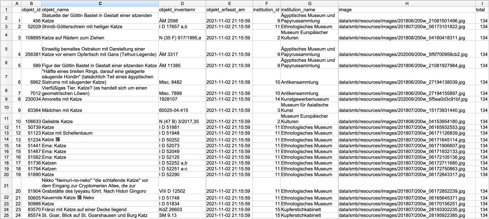
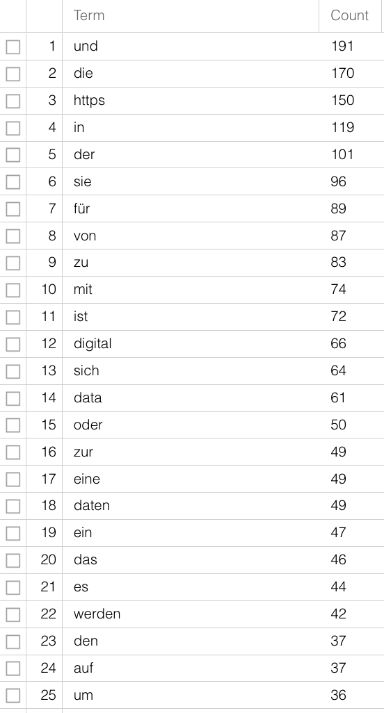
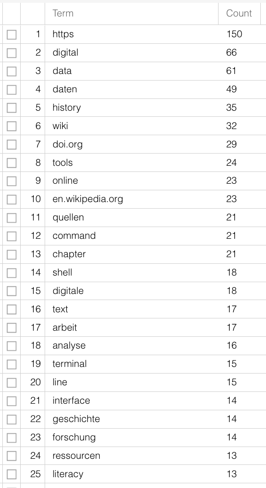

Every kind of research is reliant on data, be it gathered by questioning people, medical measurements, web scraping or the interpretative analyses of texts. 
On the basis of data, research questions can be answered, theses postulated, hypotheses refuted, narratives strengthened. 
Analyses that rely on a small set of sources, or data, often present their results in the form of syntheses, which result from a previous interpretation of the documents. 
Via the source bibliography and references in the text, the source basis becomes comprehensible; 
that a certain passage, sentence or word can be interpreted in a certain way though is also due to the influence of the researchers themselves -- a literature scholar for example, who wrote their PhD on male figures in Joanne K. Rowling's work, will read *The Cuckoo's Calling* (see @sec-digitaltools) differently from a long-time Harry Potter fan, with much reading experience but different, less formal education. 
In the discussion around the text's authorship, each will have different arguments for or against Rowling's authorship, both will give well-founded arguments, both will refer to their experience and engagement with Rowling's work and both will use individual passages or sentences in order to strengthen their argument, which a third person might use to argue exactly the opposite. 
The data basis is the same, and understandable, but the data evaluation, or the strategy by which it is evaluated is not, and thus the results gained, which again are research data, are not either.

Computer based analyses have the aspiration that all individual steps should be comprehensible, and thus that they produce reusable data: 
not just the source basis, i.e. the generation of data and the creation of a data set, but all the steps from the enrichment and refinement of data and the methods or programmes used for analysis to data storage and archiving should also be transparent, well-documented and comprehensible. 
For one, in order for the results and statements based on them to be credible, for another to allow the data to be accessible for further use, free of cost. 
We shall discuss the principles one should follow when working with data in [chapter 5](05_FAIR_CARE.en.qmd). 
For the moment we are talking about the individual steps that are frequently needed in digital history projects: data gathering, data processing, data analysis and data storage.


## Data Gathering

There are different methods you can use to gather data for historical research, we shall just mention a few in the following.

For periods of time in which there are relatively few sources and we have no serial data, **digitisation of texts** and their subsequent analysis is useful. 
Digitisation does not simply mean the transformation of a physical source into an image, but also enriching the picture with layout and text: 
only by marking those areas that are present in the text is it possible in a second step to recognise the text as such, and make it readable by a machine, and thus analyseable. 
This kind of transformation from image to text is possible both for modern texts, for which there is a typescript, and for premodern manuscripts or prints, in Latin script as well as in Arabic, Chinese or Japanese. 
There are fee-based programmes such as [Abbyy FineReader](https://pdf.abbyy.com/), but also open-source tools with or without a graphical user interface (GUI). 
Quite well known is [Transkribus](https://transkribus.eu), which compiles a number of functionalities; 
but the text recognition is liable to a fee after a certain number of pages, though some student's projects can be funded on request. 
Programmes that are run via the command line, are entirely free of charge and also offer a number of functionalities, are for instance [eScriptorium](https://sofer.info/), [Kraken](https://kraken.re/main/index.html), [OCR4all](https://www.ocr4all.org/), [OCRopus](https://github.com/ocropus/ocropy/wiki) or [Calamari](https://github.com/Calamari-OCR/calamari).


For the **extraction of data** from digital/digitised texts there are a number of possibilities: 
you can use small command line programmes (these tend to be tricky to use and difficult to read) or packages for programming languages, for the humanities usually R or Python  (see @sec-digitaltoolsen).
With these you can, for example, extract entities from digitised telephone books (person names, street names, employment) or from old theatre programmes (actors, directors, etc) and use them as data sets.^[A useful tutorial for the extraction of datasets from telephone books has been created by [Lindsey Wieck](https://lindseywieck.com/) for a DH course at St. Mary’s University in San Antonio:  [https://lindseywieck.com/fall_2016_sf/gatheringdatatutorial.html](https://lindseywieck.com/fall_2016_sf/gatheringdatatutorial.html). 
[Derek Miller](http://derek.visualizingbroadway.com/about.html) works on Broadway shows: [Visualizing Broadway](https://visualizingbroadway.com/index.html). 
The project is described  [here](https://digitalhumanities.fas.harvard.edu/100-years-of-broadway-shows-at-once/) and [here](https://www.youtube.com/watch?v=KUTPX2Ohcqs).]

The initial effort it takes to create automated data extraction and the steep learning curve for the use of some of the necessary programmes can be daunting at first. 
If you only want to analyse one theatre programme, you are sure to be quicker if you just enter the relevant data into a table. 
But if you have a larger corpus of sources with similar internal structure, such as a telephone book or a series of theatre programmes, it hardly makes a difference whether you are analysing ten or a hundred with the help of a script. 
And in addition to that you can let others use your script, or use it for similarly structured data in another project.

If you want to work with already digitised collections from public institutions such as galleries, museums or archives, (so-called  [GLAM](https://de.wikipedia.org/wiki/GLAM)s: **G**alleries,  **L**ibraries, **A**rchives, **M**useums), there is frequently the possibility of downloading data via an **interface**.^[At [openglam.ch](https://openglam.ch) you can find information about Swiss GLAM institutions that offer open data.]
Such **A**pplication **P**rogramming **I**nterfaces ([API](https://en.wikipedia.org/wiki/API)) allow communication between two computers without a graphic interface being necessary.
Instead of, for example, searching for objects or documents via the search mask of the [Staatliche Museen zu Berlin](https://smb.museum-digital.de/home?navlang=en) using different catchphrases, and then downloading the results individually, your computer can directly communicate with the museum’s API and, with quite simple commands, download long lists of results for you to work with. 
For this kind of request you can use the command line or a programming language. 
You basically just need one line, as here in the programming language R:

`library(jsonlite)` 

`cats <- fromJSON("https://smb.museum-digital.de/json/objects?&s=katze")`

> If you want to comprehend the individual steps, you can download R [here](https://www.r-project.org/). 
When you open the programme you first need to install the `jsonlite` package: 
>`install.packages("jsonlite")`\
"Enter" installs the package.\ 
Then you can type in the two lines from above and execute them by again pressing “enter”. The results are shown with \
`cats` + "Enter".

The result for your query of "katze" will be saved in the variable `cats` which can then be exported for further use as a table: 
`write.csv(cats, "docs/cats_smb.csv")`

The function `write.csv` saves the contents of the variable `cats`  as a csv file^[**c**omma **s**eparated **v**alue is a format in which individual *values* can be clearly distinguished by specific delimiters, usually *commas*, and can thus be displayed in a tabular format, where each value is stored in a separate cell. Spreadsheet software like Excel, Google Sheets, or Numbers can open csv files.] under the file path  "docs/cats_smb.csv" on your hard drive.



>In order to avoid requests that will overload their servers, most APIs have built in either an authentification or a number of maximum results per query. 
With the above example this means that you are not given the entire results list (134, as you can see in the column ‘total’), but only the first 24 -- these settings have been implemented by the developers of the API. 
If you want all results, you need to read their documentation and modify your request. For those who are interested, you can find details here.[^longnote]

[^longnote]: The API from the example is configured in such a way, that with results over 24 hits you will only be given the first 24; 
that is somewhat unusual, but we can deal with it by setting the maximum result to 10. 
That is not too high and a number with which it is easy to do sums. 
You can set the parameters for maximum results with  `&breitenat=10`.
The starting point can be changed with the parameter `&startwert=`.
Thus in order to get all hits, you can ask for the results in steps of ten, and add them together. 
So that that doesn’t develop into a copy & paste exercise, you need to use a slightly more comprehensive variable, or a number of variables. That has the benefit that you can then search for any term.\
``` R
base_URL <- "https://smb.museum-digital.de/json/objects?&s=katze"
cats <- fromJSON(base_URL)
start <-  0
breite <- 10
iterations <- cats$total[1]%/%10 + 1
endsize <- cats$total[1]-(iterations-1) * 10
cat_list <- data.frame()
for (i in 1:iterations){
  if(i < iterations){
    cat_list <- rbind(cat_list, fromJSON(paste(base_URL, "&gbreitenat=10&startwert=", start , sep="")))
  } else {
    cat_list <- rbind(cat_list,fromJSON(paste(base_URL, "&gbreitenat=", 
                                                  endsize, "&startwert=", start, sep="")))
  }
  start <- start + 10
  write.csv(cat_list, "Desktop/cat_list.csv")
}
```
First we clean the code and save the major part of the URL in  `base_URL`:\
`base_URL <- "https://smb.museum-digital.de/json/objects?&s=katze"`\
The results of the query are again stored in the object `cats`:\
`cats <- fromJSON(base_URL)`\
The number of  times you do this for one request is counted by the  `number of total results/10 + 1`; the number of hits can be taken from the column  "total" in the object  `cats`. In R you write this as follows:\
`cats$total[1]`\
For the cat example, this gives you 134 hits, so:  `(134/10 without carryover)+ 1`, so `14` iterations:\
`iterations <- cats$total[1]%/%10 + 1`\
Then you set the start value to 0:\
`start <-  0`\
And the maximum hits to 10:\
`breite <- 10`\
The last iteration need not retrieve the next ten hits, but only the remaining 4 (the last after 130): \
`endsize <- cats$total[1]-(iterations-1) * 10`\
Then we create an empty table, a data frame that we can gradually fill with our results. (With smaller quantities of data, the function `rbind` can be used to combine single tables; with larger quantities the iterative extension of data frames is not recommended.):\
`cat_list <- data.frame()`\
Once we have set these variables, we can build a loop that implements different actions under certain conditions: :\
`for (i in 1:iterations){`\
If the last iteration has not been reached yet, the request will be answered in steps of ten, each iteration moving the starting value of ten further, and the results are filled into the  `cat_list`.\
  `if(i < iterations){`\
    `cat_list <- rbind(cat_list, fromJSON(paste(base_URL, "&gbreitenat=10&startwert=", start , sep="")))`\
  ` } else {`\
  As soon as the last iteration has been reached, not ten but the number of hits saved in  `endsize` are requested, which in our example is 4:\
  `cat_list <- rbind(cat_list,fromJSON(paste(base_URL, "&gbreitenat=",`\ 
                                                  `endsize, "&startwert=", start, sep="")))`\
  `}`\
  `start <- start + 10`\
  In the end, so after 14 iterations, the table is written to a file::\
  `write.csv(cat_list, "Desktop/cat_list.csv")`\
`}`

If websites do not offer APIs there is the possibility of reaching your goal with **Web Scraping**. 
Depending on the website or its contents however, the legal situation is not always entirely clear. 
To download websites with Python there is [a course in the Programming Historian](https://programminghistorian.org/en/lessons/working-with-web-pages) by William J. Turkel and Adam Crymble. 
A further tutorial on data acquisition by Zach Coble, Liz Rodrigues, Erin Pappas, Chelcie Rowell, and Yasmeen Shorish can be found [here](https://dlfteach.pubpub.org/pub/collecting-data-web-scraping/release/1).

## Data Processing^[It is often said that data editing/preprocessing takes up 80% of your time leaving only 20% for analysis and interpretation. Leigh Dodds looked at these numbers in a  [blog article](https://blog.ldodds.com/2020/01/31/do-data-scientists-spend-80-of-their-time-cleaning-data-turns-out-no/) from 2020, and the numbers are not really as dramatic as that.]

Working with data sets, be they your own or collected by a third party, it is often the case that there is information missing or collected irregularly, making a later analysis more difficult.

If in a survey among students concerning their studies, their subject is entered into a table without having first defined values for the category, you might find instead of “History” and “German” the variants “Historical studies”, “Hist.”, “Hitsory”, “German studies”, “German language and literature”, "German studies", "Germanistics". 
Instead of the two values for two subjects, you now have nine -- without there actually more subjects being studied. 
In the best case, variants like these are prevented from the outset, by giving a set list of values. 
If, however, you receive a data set with different variants for one and the same word, you will need to combine these in order to have a useful data base. 
You could use `Ctrl-R` to try and find different variants and replace them; 
in programmes like Excel, Open Office or Google sheets you can have unique variants displayed in one column, and can then combine them to one base value; 
most helpful and easiest to use -- even for large data sets -- is the software  [OpenRefine](https://openrefine.org/), with which you can extract,^[Evan Peter Williamson: Fetching and Parsing Data from the Web with OpenRefine, Programming Historian 6 (2017), [https://doi.org/10.46430/phen0065](https://doi.org/10.46430/phen0065.https://programminghistorian.org/en/lessons/fetch-and-parse-data-with-openrefine).] clean up/normalise^[Seth van Hooland, Ruben Verborgh, Max De Wilde: Cleaning Data with OpenRefine, Programming Historian 2 (2013), [https://doi.org/10.46430/phen0023](https://programminghistorian.org/en/lessons/cleaning-data-with-openrefine).] and enrich^[Karen Li-Lun Hwang: Enriching Reconciled Data with OpenRefine, The Bytegeist Blog 2018, [https://medium.com/the-bytegeist-blog/enriching-reconciled-data-with-openrefine-89b885dcadbb](https://medium.com/the-bytegeist-blog/enriching-reconciled-data-with-openrefine-89b885dcadbb)] data in order to have a good data basis for your research question and the necessary analysis.

For text files a number of steps are needed, depending on which method or software you want to use. 
For most analyses it is sensible to work with so-called stop word lists. 
[Stop words](https://en.wikipedia.org/wiki/Stop_word) are words that have been removed from a corpus before analysis in order to get more significant results, especially when purely quantitative methods are being used for content analysis. 
Words with grammatical functions are present in great number in documents, but carry little individual meaning. 
If you analyse the raw text of this guide according to word frequency (here with  [Voyant-Tools](https://voyant-tools.org/)), you can only guess at the subject matter. 
“digital” is only on 12th place, articles and prepositions are far more frequent. Using a stop word list that removes the commonest words not carrying meaning from the text, the contents are clearer:

::: {layout="[46,-8,46]"}



:::

Further steps could be [tokenisation](https://en.wikipedia.org/wiki/Lexical_analysis#Tokenization), segmenting the text on word-level, and [lemmatisation](https://en.wikipedia.org/wiki/Lemmatization), reducing various word forms to their one base form -- “is”, “was”, “are” are turned into “be”. 
Just like with the variants in subjects earlier, the different variants have no added value for your research question and can be merged for further analysis.
There are software and packages for these steps too, so that you need not do it all yourself. 
Especially for the more widely spoken modern languages, see also  @sec-digitaltoolsen.
For non-standardised languages or language forms (dialects or premodern texts) it is more difficult. 
There are programmes for this too, but how precise they are must be judged individually.


## Data Analysis

If you have a data set, either from your own data or someone else’s, and have done preprocessing for your own use, you are (finally) ready to analyse it. 
What method or software you use depends not only on the type and amount of data you are working with, as well as the format your data is in, it also depends on your research question. 
If you have got a data base with correspondents (authors and addresses) of whom you know where they live but have forgotten to note the dates of the individual letters, you can only illustrate a spatial distribution, but hardly one across time and space.^[A large project of  Stanford University, ["Mapping the Republic of Letters"](http://republicofletters.stanford.edu/), has modeled the correspondence network of 18th century scholars through their letters. 
One example is that of Voltaire, in different visualisations:  [http://republicofletters.stanford.edu/publications/voltaire/letters/](http://republicofletters.stanford.edu/publications/voltaire/letters/). 
Dan Edelstein. 
Interactive Visualization for Voltaire’s Correspondence Network. Letters in Voltaire’s Network [Created using Palladio, http://hdlab.stanford.edu/palladio].] 
If you are only interested in the spatial distribution of female and male authors but are not interested in the question of when, then it is hardly necessary to record this information. 
Before you decide on your method, you need to ask yourself how and to what end you want to use your data set and which questions you would like answered.
In a next step we should think about the specific type of analysis that is possible with the existing data. 
Among the many possibilities for working with **structural data**, the methods most commonly used in history are  [network analysis](https://en.wikipedia.org/wiki/Social_network_analysis) or [regression analysis](https://en.wikipedia.org/wiki/Regression_analysis). 
For **textual data** there are also a number of forms of analysis, for instance word frequency count as part of [stylometry](https://en.wikipedia.org/wiki/Stylometry)/attribution of authorship (see @sec-digitaltools), [topic modeling](https://en.wikipedia.org/wiki/Topic_model) as statistical method for identifying recurring themes in larger corpora, or [sentiment analysis](https://en.wikipedia.org/wiki/Sentiment_analysis) for extracting emotions, feelings and values from text passages. 
If you have **georeferenced data**, you can analyse and visualise your data in various ways with the help of [GIS](https://guides.temple.edu/gisfords) (Geographic Information System).

Whether you use your own script for topic modeling or use existing software, whether you do your regression analysis yourself or via websites, remains your own decision. 
It is often a good idea to use existing online possibilities for initial short analyses in order to decide whether the intended method really can give the hoped-for results. 
For larger projects, in which you will perform complex analyses over a longer period of time, it could be a good idea to work with a programming language simply because you can then adjust the functions to your own needs and have full control over your data. 
A list of tools frequently used for historical analysis can be found in @sec-digitaltoolsen.


## Data Storage {#sec-sicherung-en}

In [chapter 5](05_FAIR_CARE.en.qmd) we will be looking at how to store your research data sustainably. 
At this point I shall just mention that beside storing your data, it is sensible to use version control and provide a detailed documentation. 
**Data versioning** has the advantage that you can redo individual steps, save data at various different stages and for later use, and attribute them to different team members. 
Additional version control is more than the regular back-up done by back-up programmes or clouds such as dropbox or Switchdrive, and for collaborative work in academia as well as industry, the use of  [git](https://de.wikipedia.org/wiki/Git) has established itself, often in combination with data/code repositories on [GitHub](https://de.wikipedia.org/wiki/GitHub).
Most of you will probably not have personal GitHub repositories, but will at some point use the system, mainly by downloading data that has been provided. 
The text data for this guide is also on a   [GitHub repository](https://github.com/wissen-ist-acht/digitalhistory.intro). 
Finally, the **documentation** of stored data comprises information about the development of the data set. 
How and by whom was the data collected? 
How was it annotated? 
In what format is it available? 
What software was used where? 
What does it depict? 
Storing data in different places, for instance on your local hard drive, in a cloud and on a flash-drive, can save you from losing it. 
Documentation and storing it on a repository, a long-term storage space for data, gives it additional visibility and the possibility for reuse. 
Repositories for the humanities are for instance  [DARIAH-DE](https://de.dariah.eu/en/repository) or the [DaSCH](https://www.dasch.swiss/);
there are very specialised repositories or ones that are open to all disciplines such as  [Zenodo](https://zenodo.org/) (run by Cern). 
You can deposit your data there for free, have your authorship recognised, and give the data/publication a Digital Object Identifier (DOI), an individual and enduring digital identifier, which makes it permanently citable.

