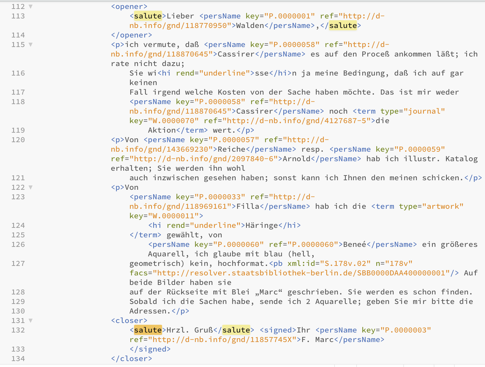

Before we take a closer look at the corpus of the letter edition, we’ll take a quick look at the possibilities of interacting with the computer, and how this can be useful for our work as historians, either for collecting, editing or analysing data.

There are two ways of interacting with (or using) a computer: via a **G**raphical **U**ser **I**nterface (GUI), so by using the mouse and clicking on objects, or, somewhat more directly, via the [command line](https://en.wikipedia.org/wiki/Command-line_interface).^[Command Line, Bash, Shell or Prompt are often found as synonymously used terms for command line interfaces. On UNIX-based operating systems like Mac OS and Linux the terminal is common as interface; details on:  https://en.wikipedia.org/wiki/Command-line_interface#History. Windows users should be able to work quite well using the PowerShell, but might want to install  [Cygwin](https://en.wikipedia.org/wiki/Cygwin) or [MinGW](https://en.wikipedia.org/wiki/MinGW), in order to be able to work with a UNIX-based interface.] If you want to delete the file “letter1.txt” in the folder “letters” via GUI, you open the Finder (Mac), the Explorer (Windows) or the file browser of your choice (Linux), and click your way to the folder “letters”, click right on the file you want to delete (“letter1.txt), click “move to bin”, or drag it there directly with the mouse. 
The same action can be written as a command: 
You open the Terminal (Linux or Mac; open the Finder and enter “terminal” in the search window, then open the programme) or a Power Shell (Windows; click right on the start symbol, then choose “Windows Power Shell”), navigate to the relevant folder by entering a command, for instance `cd Documents/letters` + 'Enter' (Mac und Linux) or `cd ./Documents/letters` (Windows) and enter the command `rm letter1.txt`, which is executed by pressing 'Enter'. 


``` bash
(base) serina00@dg-19-mac-02 ~ % cd Documents/Briefe
```
``` bash
(base) serina00@dg-19-mac-02 Bilder % rm Brief1.txt
```

::: {#movie}

<iframe width="560" height="315" src="images/terminal_file_system.mov"></iframe>

How to proceed in the command line/in the terminal using MacOS
:::

The two methods differ in three points:

1.  The command `rm` is final, the file is deleted without grace period in the bin.
2.  The command is relatively simple to use for a number of documents at once, whereby quite different conditions can be taken into account, and it can be combined with other commands.
3.  Terminal looks k3wl.

Before we take a look at the second and for us most helpful difference, a brief note on the command line.

## Shell 101

In a terminal/shell (see footnote for differentiation) commands or programmes can be executed that occur on the *structural* level -- for instance deleting a file,  `rm Dateiname.xyz` (`rm` for *remove*), or creating a folder, `mkdir NewFolder` (`mkdir` for *make directory*). Equally possible are operations on a *content* level -- such as searching for a certain term in a text file, `grep 'term' textfile.txt` (Mac/Linux) or `Select-String -Path textfile.txt -Pattern 'term'` (Windows), or counting terms and saving the results in a new file, `grep -Ec '(term1|term2)' textfile.txt | wc -l > results.txt` (Mac/Linux) or `(Select-String -Path textfile.txt -Pattern '(term1|term2)'.Matches.Count > results.txt` (Windows) -- the commands will explained more fully below.

But how does your Shell know what it is supposed to do when you type `rm` or `grep`/`String-Select`? 
There are all sorts of Shell programmes that are already installed on your system and with which you can do a lot. 
Open your Shell, type in  `date` and press 'Enter': 
You will see the current date and time appear. 
(Your Shell looks for the first argument, the command  `date`, in the filesystem of your computer, and if it is successful, implements the action according to the given parameters.)

::: {.callout-note}
tmi: If you type in  `echo $PATH` into the Terminal (Mac/Linux) or `$env:PATH` (Windows), you will see a list of the places in which a command is searched for.
Type `which date`  and press ‘Enter’ to see where the programme ‘date’ is on your computer. 
:::

If you type a command that does not exist, or for which there is no programme installed on your computer, you will get an error notification -- you can’t do any damage.

``` bash
(base) serina00@dg-19-mac-02 ~ % nonsense
```
``` bash
command not found: nonsense
```
The windows output is a bit more extensive: 

``` bash
nonsense: The term 'nonsense' is not recognized as a name of a cmdlet, function, script file, or executable program.
Check the spelling of the name, or if a path was included, verify that the path is correct and try again.
```

The current date is probably also shown in your toolbar, and you can create a new folder with a right click -- you don’t really need the Terminal for that. 
To find a term in a text file you can open the document, press `Ctrl-F`, type in the term and see the result. 
If you want to search for more terms, you need to repeat the same action with `Ctrl-F`, term2. 
And if you want to search more than one file, perhaps to find out how often the salutation “Mit herzlichem Gruss” appears in a letter collection, you have to repeat the search in every file. 
If you then need to look for the variant “Mit herzlichen Grüssen” or even “Herzl. Gruss”, your work will be multiplied.

You can also do the same in the Terminal and use some of the built-in programmes to save yourself time and work.


## `Ctrl-F` 2.0

As in the previous chapter, we are working with a part of the source corpus of the edition “Der Sturm”, with those letters written by [Franz Marc](https://sturm-edition.de/register/personen/P.0000003.html).

To fully understand the following steps, please download the folder “letters_Der_Sturm”. 
You can either download the complete [GitHub repository of this guide](https://github.com/wissen-ist-acht/digitalhistory.intro) as a zip file, and find the folder “letters_Der_Sturm” in the folder “docs”.

{fig-align="left"}

You can clone the repository via the command line
``` bash
git clone https://github.com/wissen-ist-acht/digitalhistory.intro.git
```
Or for a lazy option use this direct  [link](https://download-directory.github.io/?url=https://github.com/wissen-ist-acht/digitalhistory.intro/tree/main/docs/letters_Der_Sturm).

If you want to use the [website’s API](https://sturm-edition.de/ressourcen/schnittstellen.html) you only need a few commands to get at the files.

::: {.callout-caution collapse="true"}
## Download using the API 
With the first command we create a file, “letters_marc.xml”,  with the file names of all the letters written by Franz Marc -- from the register on the website we know that he has the person ID P.0000003; the URL of the API is in the  [documentation](https://sturm-edition.de/ressourcen/schnittstellen.html):\
Mac/Linux:
```bash
curl https://sturm-edition.de/api/persons/P.0000003 --output letters_marc.xml
```
Windows:
```bash
Invoke-WebRequest -Uri "https://sturm-edition.de/api/persons/P.0000003" -OutFile "letters_marc.xml"
```
If you open the file with an editor that can read XML files, you can see that next to the file names following “target=”, there are lots of things we do not need:
```xml
<person xmlns="http://www.tei-c.org/ns/1.0" source="http://d-nb.info/gnd/11857745X" xml:id="P.0000003">
    <persName type="pref">Marc, Franz</persName>
    <persName type="fn">Franz Marc</persName>
    <linkGrp type="files">
        <ptr n="Bl.375" target="Q.01.19191212.JVH.01.xml"/>
        <ptr n="Bl.377" target="Q.01.19200114.JVH.01.xml"/>
        <ptr n="Bl.219" target="Q.01.19160128.FMA.01.xml"/>
        <ptr n="Bl.222" target="Q.01.19160205.FMA.01.xml"/>
        <ptr n="Bl.223" target="Q.01.19160302.FMA.01.xml"/>
        <ptr n="Bl.218" target="Q.01.19160101.FMA.01.xml"/>
        <ptr n="Bl.221" target="Q.01.19160122.FMA.01.xml"/>
        <ptr n="Bl.220" target="Q.01.19160115.FMA.01.xml"/>
        <ptr n="Bl.207" target="Q.01.19150703.FMA.01.xml"/>
        ...
```

We only really need the file names to download the files with the relevant command.
We can also see that it is not only letters with the abbreviation “FMA” for Franz Marc that are listed, but also nine with “JVH”, Jacoba van Heemskerck.  
If you open the relevant files, you can see that they are ones in which Franz Marc is mentioned and is tagged in TEI-XML with  `persName key="P.0000003"` which is why they are part of the results listed. 
With a second command we then create a new file, in which the individual extracted file names are listed without those letters of Jacoba van Heemskerck, combined with the download command `curl` and supplemented with the relevant  URL for the download:\
Mac/Linux:
``` bash
cat letters_marc.xml | grep -o 'Q.*FMA.*.xml\b' | perl -nle 'print "curl -o $_ https://sturm-edition.de/api/files/$_ "' > filenames_letters_marc.txt
```
Windows:
```bash
Select-String -Path "letters_marc.xml" -Pattern 'Q.*FMA.*\.xml\b' | ForEach-Object {
    $match = $_.Matches[0].Value
    "curl -o $match https://sturm-edition.de/api/files/$match"
} > filenames_letters_marc.txt
```

The file "filenames_letters_marc.txt" looks like this:
```bash
curl -o Q.01.19160128.FMA.01.xml https://sturm-edition.de/api/files/Q.01.19160128.FMA.01.xml 
curl -o Q.01.19160205.FMA.01.xml https://sturm-edition.de/api/files/Q.01.19160205.FMA.01.xml 
curl -o Q.01.19160302.FMA.01.xml https://sturm-edition.de/api/files/Q.01.19160302.FMA.01.xml 
curl -o Q.01.19160101.FMA.01.xml https://sturm-edition.de/api/files/Q.01.19160101.FMA.01.xml 
curl -o Q.01.19160122.FMA.01.xml https://sturm-edition.de/api/files/Q.01.19160122.FMA.01.xml 
curl -o Q.01.19160115.FMA.01.xml https://sturm-edition.de/api/files/Q.01.19160115.FMA.01.xml 
curl -o Q.01.19150703.FMA.01.xml https://sturm-edition.de/api/files/Q.01.19150703.FMA.01.xml 
curl -o Q.01.19150417.FMA.01.xml https://sturm-edition.de/api/files/Q.01.19150417.FMA.01.xml 
curl -o Q.01.19151106.FMA.01.xml https://sturm-edition.de/api/files/Q.01.19151106.FMA.01.xml 
curl -o Q.01.19150918.FMA.01.xml https://sturm-edition.de/api/files/Q.01.19150918.FMA.01.xml 
curl -o Q.01.19150827.FMA.01.xml https://sturm-edition.de/api/files/Q.01.19150827.FMA.01.xml 
curl -o Q.01.19150303.FMA.01.xml https://sturm-edition.de/api/files/Q.01.19150303.FMA.01.xml 
...
```

`cat letters_marc.xml` (Mac/Linux)/`-Path "letters_marc.xml"` (Windows) passes the content of the file to the Terminal; 
`grep -o 'Q.*FMA.01.xml\b'` (Mac/Linux) or `Select-String -Pattern 'Q.*FMA.*\.xml\b'` (Windows) finds all character strings between “Q” and “FMA.01.xml” in the list, with `\b` after "xml" marking the end of the pattern; 
the 45 discovered strings are then each written in a new line, with `curl -o $_` giving the command `curl -o` and with `$_` (Mac/Linux) or `$match` (Windows) as placeholder for the character string (i.e. the file name), followed by  `https://sturm-edition.de/api/files/$_` (Mac/Linux) or `https://sturm-edition.de/api/files/$match`(Windows) and again with `$_` or `$match` the character string (again the file name).
With a third command, `bash`, you execute the created file, meaning that the commands in the file will be executed and the letters downloaded via the command  `curl` (**C**lient **URL**).
```bash
bash filenames_letters_marc.txt
```
:::

However you have decided to download the files, you should now have 45 letters in XML format on your computer. 
Now open the Terminal (Mac/Linux) or the PowerShell (Windows) and with  `cd`, `change directory`, navigate to the folder in which your text files are saved. \
In my case this is in Documents/GitHub/digital_history_intro/docs/letters_Der_Sturm.

``` bash
(base) serina00@dg-19-mac-02 ~ % cd Documents/GitHub/digital_history_intro/docs/letters_Der_Sturm`
```

For most of you, it will probably be in  "Downloads" -- give it a try.

(In order to check what is in a folder, you can enter  `ls` (for `list`) in the Terminal, or `dir` (for `directory`) in the PowerShell):

``` bash
ls
```
``` bash
Q.01.19140115.FMA.01.xml	Q.01.19150315.FMA.02.xml
Q.01.19140119.FMA.01.xml	Q.01.19150327.FMA.01.xml
Q.01.19140121.FMA.01.xml	Q.01.19150417.FMA.01.xml
Q.01.19140124.FMA.01.xml	Q.01.19150501.FMA.01.xml
Q.01.19140125.FMA.01.xml	Q.01.19150615.FMA.01.xml
Q.01.19140125.FMA.02.xml	Q.01.19150703.FMA.01.xml
Q.01.19140409.FMA.01.xml	Q.01.19150710.FMA.01.xml
Q.01.19140414.FMA.01.xml  Q.01.19140421.FMA.01.xml
Q.01.19150827.FMA.01.xml  Q.01.19140507.FMA.01.xml
...
```

## First Steps

Once you have navigated to the folder that has your letter files in them, instead of opening every single file as you would in a text editor, and searching with  `Ctrl-F`, you can search for salutations with one single command. 
In the Terminal/in the PowerShell, with the programme  `grep` (Global Regular Expression Print, Mac/Linux) or `Select.String` (Windows), you can search all the letters in the folder by including all files ending on “.xml” in the search. 
You can see the results -- in this search for the salutations “Mit herzlichem Gruss” or “Mit herzlichen Grüssen” one hit per file -- in your Terminal/PowerShell.

Mac/Linux:
``` bash
grep -E -i '(Mit herzlichem Gruß|Mit herzlichen Grüßen)' *.xml 
```

Windows:
``` bash
Select-String -Path *.xml -Pattern "(Mit herzlichem Gruß|Mit herzlichen Grüßen)"
```
Output:
``` bash
Q.01.19160115.FMA.01.xml:               <salute>Mit herzlichen Grüßen für Sie beide</salute> <signed>Ihr <persName key="P.0000003" ref="http://d-nb.info/gnd/11857745X">F.Marc</persName>
```
So the formulation “Mit herzlichen Grüßen” appears once in your corpus, in the document Q.01.19160115.FMA.01.xml.

You can also get the **w**ord **c**ount of the number of hits found on line level, `-l`, with `wc-l` (Mac/Linux), or `Matches.Count` (Windows) and write them into a new file with `>` (that will be created when you execute your command).

Mac/Linux:
``` bash
grep -E -i '(Mit herzlichem Gruß|Mit herzlichen Grüßen)' *.xml | wc -l > count_greetings.txt
```

Windows:
``` bash
(Select-String -Path *.xml -Pattern "(Mit herzlichem Gruß|Mit herzlichen Grüßen)").Matches.Count > count_greetings.txt
```

When you open the newly created file count_greetings.txt, which will be in the same folder as the letters, you should find that it says “1”, since our search gave us one hit.

The command `grep` (Mac/Linux) was given the additional parameter `E` in the above command, and the command `Select.String` (Windows) the parameter `-Pattern`, meaning that we are not looking for an exact string, but are using the option of pattern searches. 
These are formulated as so-called **E**xtended [Regular Expressions](https://en.wikipedia.org/wiki/Regular_expression) (that is where you get the  `E`).
We have not only searched for "Mit herzlichem Gruß", but also for "Mit herzlichen Grüßen", which we formulated with the symbol "|", which here means "or".
With the help of regular expressions we can extend our search further and search for different variants at once.

::: {.callout-note}
Regular expressions have different *flavours* -- depending on the programming language things are formulated in different ways, and some default settings differ. 
In our case,  `grep` needs the parameter  `-i`, in order to ignore upper/lower case.
`Select.String` ignores it by default and does not need additional parameters.
These details are important to know about when working with regular expressions, but is something you will learn on the go.   
:::

Mac/Linux:
``` bash
grep -E -i '(Mit herzlichem Gru(ß|ss)|Mit herzlichen Grü(ß|ss)en|H(e|.?)rzl. Gru(ß|ss))' *.xml | wc -l
```

Windows:
``` bash
(Select-String -Path *.xml -Pattern "(Mit herzlichem Gru(ß|ss)|Mit herzlichen Grü(ß|ss)en|H(e|.?)rzl. Gru(ß|ss))").Matches.Count > count_greetings.txt
```

With this formulation you will find 17 hits for a salutation, with the possible variants of "Mit herzlichem Gruß", "Mit herzlichem Gruss", "Mit herzlichen Grüßen", "Mit herzlichen Grüssen", "Herzl. Gruß", "Herzl. Gruss", "Hrzl. Gruß", "Hrzl. Gruss".

If you would like to find out whether greetings were sent  *herzlich*, *hrzl.* or *freundlich* you can modify the search and form of output:

Mac/Linux:
``` bash
grep -E -i 'Gr(u|ü)(ß|ss)' *.xml
```

Windows:
``` bash
Select-String -Path *.xml -Pattern "Gr(u|ü)(ß|ss)"
```
Output:
``` bash
Q.01.19140115.FMA.01.xml:                    stets sofort antworte; es muß verloren gegangen sein. Grüßen Sie bitte D<hi rend="super">
Q.01.19140119.FMA.01.xml:                    <salute>Hrzl. Gruß</salute> <signed>Ihr <persName key="P.0000003" ref="http://d-nb.info/gnd/11857745X">F. Marc</persName>
Q.01.19140125.FMA.02.xml:                    <salute>Hrzl. Gruß</salute>
Q.01.19140421.FMA.01.xml:                        <closer>Gute Besserung <persName key="P.0000002" ref="http://d-nb.info/gnd/118891456">Ihrer Frau</persName> u. <salute>viel Grüße von mir</salute> <signed>Ihr <persName key="P.0000003" ref="http://d-nb.info/gnd/11857745X">Fz Marc</persName>
Q.01.19140507.FMA.01.xml:                    <salute>besten Gruß</salute>
Q.01.19140831.FMA.01.xml:                    <salute>Hrzl. Gruß von Eurem Freund in Waffen</salute> <signed>
Q.01.19141113.FMA.01.xml:                    <salute>Hrzl. Gruß 1 x 2</salute> <signed>Ihr <persName key="P.0000003" ref="http://d-nb.info/gnd/11857745X">Fz. Marc</persName>
Q.01.19150112.FMA.01.xml:                    <salute>Hrzl. Gruß Ihnen beiden</salute>
Q.01.19150116.FMA.01.xml:                    <salute>Mit herzl. Gruß Ihnen beiden</salute> <signed>Ihr <persName key="P.0000003" ref="http://d-nb.info/gnd/11857745X">FrM</persName>.</signed>
Q.01.19150121.FMA.01.xml:                    <salute>Herzl. Gruß</salute> <signed>Ihr <persName key="P.0000003" ref="http://d-nb.info/gnd/11857745X">Fz. Marc</persName>
...
```
With this command you are searching the text for the pattern  `Gr(u|ü)(ß|ss)`, so a phrase that starts with  `Gr` or `gr`, followed by either a  `u` or a `ü`, then followed by either a  `ß` or `ss`. 
As we have not marked a word-end (you would do that with `\b`), you will also find “Grüße” or “Grüssen”.

If you have clicked your way through the letters while reading the previous chapter, you will have noticed that not all letters end on “Gruss” or “Grüssen”. 
In the output of the queries in the Terminal you can see that all salutations are surrounded by a tag-pair:  
`<salute>` marks the beginning of the salutation, `</salute>` the end.
Open one of the letter files and search for “salute”. 
(If you do not have an XML capable editor on your computer, just open the file in your browser.)


{fig-align="left"}


As you can see, you twice have the tag-pair `<salute>-</salute>`, once framed by the tag-pair `<opener>-</opener>`, once by `<closer>-</closer>`.
The address is marked with the first, the salutation with the second tag-pair. 
So when we are working with files that have been marked up according to fixed rules, we can search for the element of the salutation without first having to look at the texts and formulate various queries. 
Now we change the formulation of our query and search for a string of characters beginning with `<closer>`, followed by from zero to however many (`.*`) characters of the class `cntrl`, so invisible characters such as tabs, page breaks, or line breaks. 
Then follows  `<salute>`, again followed by from zero to however many (`.*`) characters, followed by from zero to however many (`.*`) characters of class  `cntrl` and again followed by from zero to however many (`.*`) characters, until you get to the beginning of the closing tag `</salute>`.
Like this, you can cover all possible cases in the letters in which you find text or line breaks between  `<closer>` and `<salute>` or not, and in which there is text, no text or a line break between  `<salute>` and `</salute>`.

Mac/Linux:
```bash
grep -E -zo '<closer>[[:cntrl:]].*<salute>.*[[:cntrl:]].*<'  *.xml
```

Output:
```bash
Q.01.19140115.FMA.01.xml:<closer>
                    <salute>Hrzl.<
Q.01.19140119.FMA.01.xml:<closer>
                    <salute>Hrzl. Gruß</salute> <signed>Ihr <persName key="P.0000003" ref="http://d-nb.info/gnd/11857745X">F. Marc<
Q.01.19140121.FMA.01.xml:<closer>
                    <salute>Hrzl.</salute> <signed>Ihr <persName key="P.0000003" ref="http://d-nb.info/gnd/11857745X">FzMarc<
Q.01.19140125.FMA.02.xml:<closer>
                    <salute>Hrzl. Gruß<
Q.01.19140409.FMA.01.xml:<closer>
                    <salute>Herzl.<
Q.01.19140414.FMA.01.xml:<closer>
                    <salute>Hrzl.</salute> <signed>Ihr <persName key="P.0000003" ref="http://d-nb.info/gnd/11857745X">FMarc</persName>.<
Q.01.19140507.FMA.01.xml:<closer>
                    <salute>besten Gruß<
Q.01.19140512.FMA.01.xml:<closer>
                    <salute>Hrzl.</salute> <signed>Ihr <persName key="P.0000003" ref="http://d-nb.info/gnd/11857745X">Fr Marc<
Q.01.19140606.FMA.01.xml:<closer>
                    <salute>Hrzl.</salute> <signed>Ihr <persName key="P.0000003" ref="http://d-nb.info/gnd/11857745X">Fz. Marc<
Q.01.19140608.FMA.01.xml:<closer>
                    <salute>hrzl.</salute> <signed>Ihr <persName key="P.0000003" ref="http://d-nb.info/gnd/11857745X">F. Marc<
...

```
If you want to write the results directly into a file you can of course also do that:
 
 Mac/Linux:
```bash
grep -E -zo '<closer>[[:cntrl:]].*<salute>.*[[:cntrl:]].*<'  *.xml > salutations.txt
```

But this is the moment, at the latest, to change your tools. 
You can do all sorts of things with the Terminal/Shell and there are any number of programmes you can install in addition -- to parse XML files, to work on image files or to download Youtube videos. 
But it starts getting less and less neat and for the analysis of structural and textual data you can use programming languages like R or Python (as mentioned in  [@sec-digitaletoolsen] which are more practical.


To continue working with the full text of the letters, be it for close reading or quantitative text analysis, you could, for example, strip the XML tags to achieve a better reading experience and to facilitate further analysis.

