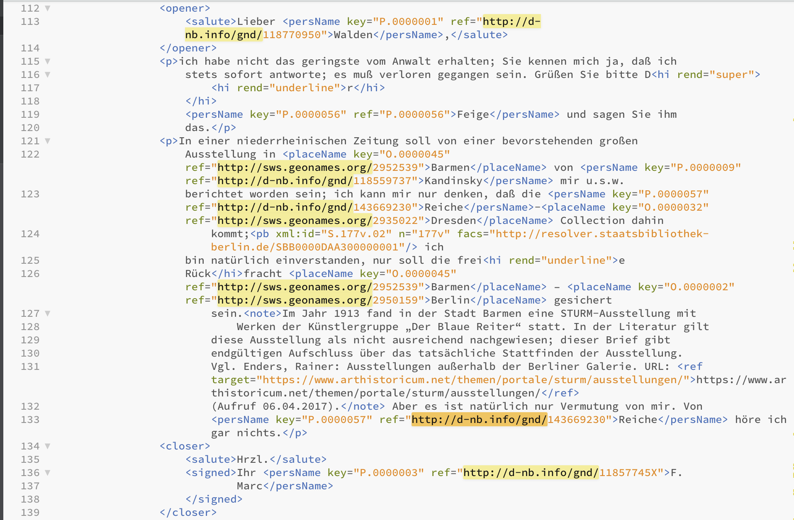
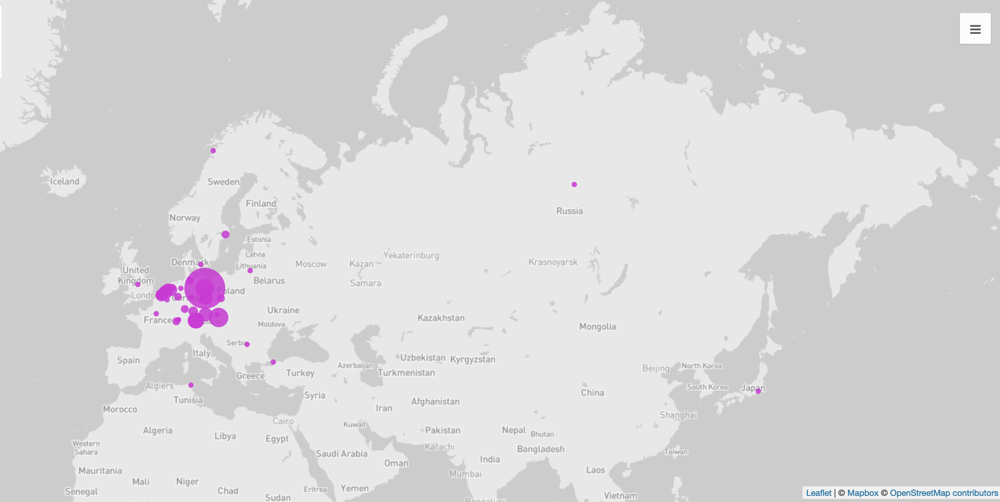
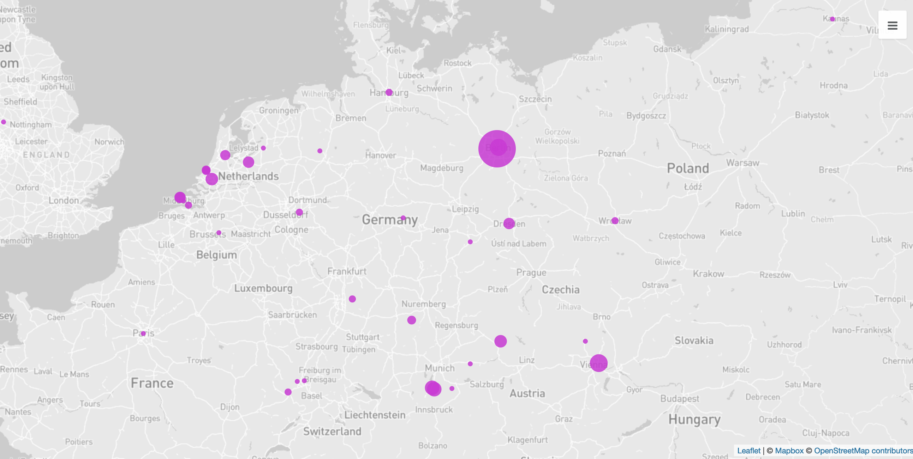
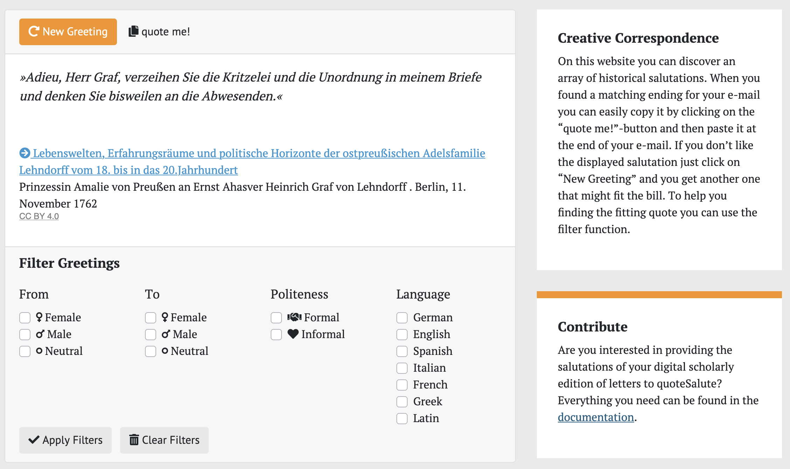

If you now compare the way you structured letter no 8 from Franz Marc to Herwarth Walden and the way in which you identified entities with the way in which it is done in the XML files of the STURM editors, you will probably find some differences. 
One difference will most certainly be that the editors followed a model in their structuring, which is the standard for text editions. 
It is called  [TEI](https://en.wikipedia.org/wiki/Text_Encoding_Initiative), and using it can have a number of benefits. 
It means for instance, that you can follow through with the queries shown in the previous chapter without wondering whether the tag name is going to change halfway through. 
And if you decide during your research to concentrate on the address rather than the salutation, or to include the corpus of letters by [Jacoba van Heemskerck](https://en.wikipedia.org/wiki/Jacoba_van_Heemskerck), you can do this with only very few changes to your queries, as these too are encoded with a unified tag. 
If you only read the texts via the browser and counted things out by hand, you would have to start all over again with the addition of new documents.

The creation of standardised data according to a model or fixed guidelines also means that you can compare different data sets with each other or enrich them with additional data. 
Looking at the letters, on the website or in the XML file, you can see that entities such as persons or places are not only marked as such and linked internally within the project, but are also linked to other authoritative data, for instance with the relevant entry in the  [GND](https://en.wikipedia.org/wiki/Integrated_Authority_File), the Gemeinsame Normdatei der Deutschen Nationalbibliothek, or in  [Geonames](https://en.wikipedia.org/wiki/GeoNames), a data base for geographical data.

{fig-align="left"}

If you click on the link to [Kandinski](http://d-nb.info/gnd/118559737) or [Berlin](https://www.geonames.org/2950159/berlin.html), you will find additional information for the person or place on the website of GND or Geonames, such as dates and geocoordinates. 
If you now for example would like to know which places are named in the letters of Franz Marc, you can extract these not only with the tag pair `<placeName>-</placeName>`, but also with the added geocoordinates, and you can then visualise them on a map.

{fig-align="left"}

{fig-align="left"}

For such processes you need a brief (though not necessarily briefly created) [script](https://github.com/wissen-ist-acht/digitalhistory.intro/blob/main/docs/parse_tei_files.R), that you can change according to your aim or desired style of visualisation.^[In this case the [csv file](https://github.com/wissen-ist-acht/digitalhistory.intro/blob/main/docs/place_names_letters.csv) was created with the help of the script in the link (written in the programming language R), and was [refined](https://openrefine.org/docs/manual/reconciling#reconciliation-actions), with OpenRefine in order to add geocoordinates to the addresses. 
This [enriched spreadsheet](https://github.com/wissen-ist-acht/digitalhistory.intro/blob/main/docs/place_names_letters_coordinates.csv) was uploaded into the online tool [Palladio](https://hdlab.stanford.edu/palladio/) gwhich can place coordinates on a map.]
This can then be used with relatively little additional work for other documents -- whether you are only interested in extracting and visualising places from the letters of Franz Marc or also those of Jacoba van Heemskerck, has no impact on the script’s computation time.

So, creating data sets according to specific principles, formal ones but also with a view to the [FAIR principles](05_FAIR_CARE.en.qmd), has many benefits for both your own work -- you need not formulate new data models by yourself -- and for that of others -- important basic information can be transferred, leaving more time for actual research.

A nice example for the reuse of data is the project  [quoteSalute](https://correspsearch.net/de/quotesalute/suche-salutes.html), created by students, a website on which you can generate historical salutations, in case you are getting bored with current standard forms. 
The project uses a number of XML encoded letter corpora, that are all online as openly usable data, for which they extracted and enriched the salutations. 
You can find the exact description  [here](https://correspsearch.net/en/quotesalute/documentation.html). 

{fig-align="left"}

As you can see, you can not only generate salutations, but also filter the search, for instance according to the gender of the sender or according to language. 
This is possible because the existing annotation of the text files has been extended in the project, for example with information on the gender of a person, if apparent. 
The code used is openly accessible on a  [GitHub repository](https://github.com/telota/quoteSalute), and new corpora are welcome.

What this guide wanted to show is that computer-assisted and computer-based work can make the processes we can use for our historical research easier, quicker, sometimes even at all possible. 
There are nowadays countless programmes you can use via a graphic interface that are perfectly adequate for most requirements we have in the humanities. 
But some analyses require very specific steps or a lot of computing capacity for which it can be worth learning a programming language. 
Both for formulating an interesting research question and for the choice of data, as well as for the interpretation of the results given by the machine, you need informed expertise -- a programme that should identify the author of an unknown text needs an incredibly long time if it wants to compare all existing texts with the unknown one. 
You need an expert, a literary scholar, to choose the relevant corpus it should refer to. 
Historical research is always also the analysis of the individual case, the particular, it is a close reading; 
the possibility of widening one's gaze with the assistance of the computer can in most cases be an interesting option.
